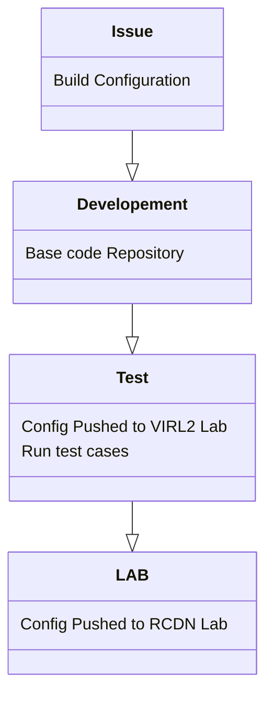

# Usage

This project is a full CI/CD pipline for configuration management. All configuration changes should be made by logging an issue then merging the changes to the `Development` branch then `Test` branch and finaly the `LAB` branch.

# Setup

Start by updating the host field to mach your enviroment.
.
..
...

# Run playbooks directly

To run the playbook without committing changes:

    ansible-playbook -i network.hosts configure_network.yml -e "commit_changes=0"

To run the playbook committing the changes:

    ansible-playbook -i network.hosts configure_network.yml -e "commit_changes=1"

# Default Topology
